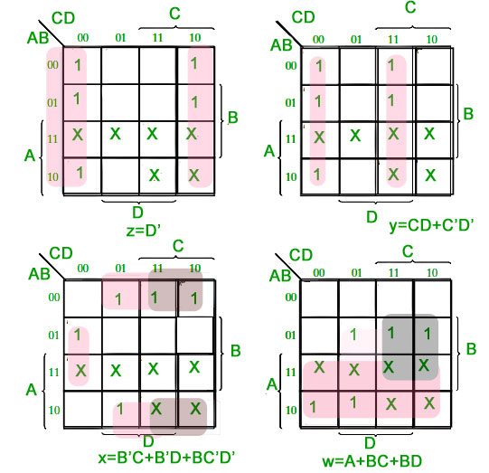

### Introduction

### BCD to Excess-3

As is clear by the name, a BCD digit can be converted to it’s corresponding Excess-3 code by simply adding 3 to it. Let A, B, C and D be the input bits and W, X, Y and Z be the output bits. Then the truth table for the conversion from BCD to Excess-3 is as follows:

<table style="width:50%">
<tr>
  <th colspan="4">BCD Code (INPUT)</th>
  <th colspan="4">Excess 3 Code (OUTPUT)</th>
</tr>
<tr>
  <td> A </td><td> B </td><td> C </td><td> D </td><td> W </td><td> X </td><td> Y </td><td> Z </td>
</tr>
<tr>
  <td>0</td><td>0</td><td>0</td><td>0</td><td>0</td><td>0</td><td>1</td><td>1</td>
</tr>
<tr>
  <td>0</td><td>0</td><td>0</td><td>1</td><td>0</td><td>1</td><td>0</td><td>0</td>
</tr>
<tr>
  <td>0</td><td>0</td><td>1</td><td>0</td><td>0</td><td>1</td><td>0</td><td>1</td>
</tr>
<tr>
  <td>0</td><td>0</td><td>1</td><td>1</td><td>0</td><td>1</td><td>1</td><td>0</td>
</tr>
<tr>
  <td>0</td><td>1</td><td>0</td><td>0</td><td>0</td><td>1</td><td>1</td><td>1</td>
</tr>
<tr>
  <td>0</td><td>1</td><td>0</td><td>1</td><td>1</td><td>0</td><td>0</td><td>0</td>
</tr>
<tr>
  <td>0</td><td>1</td><td>1</td><td>0</td><td>1</td><td>0</td><td>0</td><td>1</td>
</tr>
<tr>
  <td>0</td><td>1</td><td>1</td><td>1</td><td>1</td><td>0</td><td>1</td><td>0</td>
</tr>
<tr>
  <td>1</td><td>0</td><td>0</td><td>0</td><td>1</td><td>0</td><td>1</td><td>1</td>
</tr>
<tr>
  <td>1</td><td>0</td><td>0</td><td>1</td><td>1</td><td>1</td><td>0</td><td>0</td>
</tr>
</table>

From the truth table above, we draw the K-Maps for each of the output variables W, X, Y and Z.

### Stuck At Faults 

A stuck-at fault (SAF) is a logic-level fault. Stuck at faults occur when a line is permanently stuck to Vdd or ground giving a faulty output. This line may be an input or output to any gate. Also this fault can be single or multiple stuck at faults. 

There are two kinds of SAF: 
<ol>
    <li>Stuck At 0</li>
    <li>Stuck At 1</li>
</ol>

When a signal, or gate output, is stuck at a 0 or 1 value, independent of the inputs to the circuit, the signal is said to be "stuck at" and the fault model used to describe this type error is called a "stuck at fault model".

A circuit with n lines can have (3n)-1 possible stuck line combinations. Each line can be Stuck At 0, Stuck At 1 or No Fault.

#### Examples of Stuck At 1 Faults for XOR gate 

